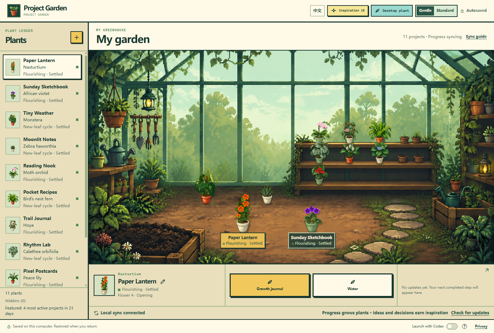

# Project Garden

**English** · [简体中文](README.md)

Grow real project progress into pixel-art plants on your desktop. A working prototype, a finished piece of writing, or a completed feature becomes another step toward fresh leaves and flowers. Return to a greenhouse that grows alongside your work.



*Screenshots use fictional projects and demo progress. No personal projects or real saves are shown.*

## A small greenhouse of your own

- **One project, one plant.** Tasks in the same Codex project care for the same plant. Its species is revealed after the first verifiable result.
- **Growth at its own pace.** Plants pass through six stages, then keep developing flowers or leaves. Recently active projects occupy the foreground; the others live on the shelves.
- **Two ways to keep company.** Open the full greenhouse or switch to a transparent desktop plant window. Both English and Chinese interfaces are available.
- **Make it yours.** Choose terracotta, cream, or moss-green pots for individual plants. Earn decoration inspiration from new ideas and decisions, then add shelves and gardening accessories.

## Meet the plants

There are **11 species**, each with its own foliage and flower or leaf development:

| Your kind of greenery | Examples |
| --- | --- |
| Bright blooms | Nasturtium, African violet, phalaenopsis orchid, hydrangea, anthurium |
| Expressive foliage | Monstera, bird’s nest fern, calathea orbifolia |
| Compact or delicate | Haworthia, hoya, peace lily |

Confirmed results grow plants; chat length and tokens earn no progress. New ideas and decisions earn separate decoration inspiration. Growth records preserve the original event date, even when an update arrives later.

## Ask Codex to install

Send this to **Codex running locally on Windows**:

> Install https://github.com/lirrirl25/project-garden using its INSTALL.md. Set up the app and sync plugin, then verify the installation. Keep launch with Codex off for now.

Open a new Codex task after installation to load the sync plugin. Use the **Launch with Codex switch at the bottom right, beside Privacy**, to change startup behavior. The **?** button explains how it works. Fresh installations default to off.

Windows is currently supported, with Node.js 22.12+ and Codex required. The installer can install Node.js; OS permission or login steps may require your action. While the repository is private, your GitHub account needs access to install it.

<details>
<summary>Manual installation</summary>

```powershell
git clone https://github.com/lirrirl25/project-garden.git
cd project-garden
powershell -NoProfile -ExecutionPolicy Bypass -File .\install.ps1 -InstallPrerequisites
```

</details>

## Your data stays local

Plants and records are saved on this computer and restored when you return. Sync events carry only anonymous project identifiers and progress levels, without conversations, code, or project content. Updates can wait in a local queue while the garden is closed and arrive when you reopen it.

[Install, update & uninstall](INSTALL.md) · [Full growth rules](docs/RULES.md)
