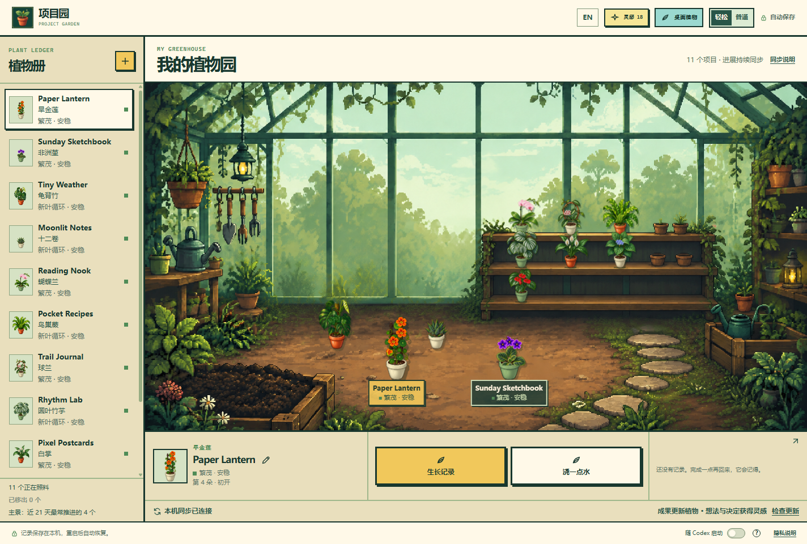

# Project Garden · 项目园

[English](README.en.md) · **简体中文**

把真实项目的进展，养成桌面上的像素植物。写完一段程序、做出可用原型、完成一份作品，都能成为植物长出新叶或花苞的一步。忙完回来，看见自己的项目慢慢长成一座温室。



*截图使用虚构项目与演示进度，不包含个人项目或真实存档。*

## 你的小小温室

- **一个项目，一株植物。** 同一 Codex 项目的不同任务共同照料同一株；首次可验证成果会揭晓植物品种。
- **生长有自己的节奏。** 植物经历六个成长阶段，之后继续长出花叶。温室前景展示近期常推进的项目，其他植物安放在后方花架。
- **两种陪伴方式。** 打开完整温室查看项目，也可以切换到透明的桌面植物窗口。支持中英文界面。
- **按喜好装点。** 为单株植物换陶盆、奶油釉盆或苔绿釉盆，用新想法和决定获得的灵感添置花架与园艺装饰。

## 会遇见哪些植物？

目前有 **11 种**，各自拥有不同的叶形和花叶变化：

| 喜欢的感觉 | 植物例子 |
| --- | --- |
| 花色明亮 | 旱金莲、非洲堇、蝴蝶兰、绣球、红掌 |
| 叶片舒展 | 龟背竹、鸟巢蕨、圆叶竹芋 |
| 小巧或清雅 | 十二卷、球兰、白掌 |

成长来自已确认的项目成果，聊天长度和 token 数不计分。新想法与决定单独奖励装饰灵感。生长记录保留成果发生的日期，离线补收也不会把它改成接收日期。

## 让 Codex 安装

在 **Windows 本机的 Codex** 中发送：

> 请安装 https://github.com/lirrirl25/project-garden 。按照仓库 INSTALL.md 完成安装、连接同步插件并验证。随 Codex 启动先保持关闭。

安装后打开一个新 Codex 任务，加载同步插件。应用右下角、**隐私说明左侧的「随 Codex 启动」开关**可随时开关；旁边的 **?** 会解释启动行为。首次安装默认关闭。

目前支持 Windows，需要 Node.js 22.12+ 和 Codex。安装流程可补装 Node.js；系统授权或登录步骤仍需用户完成。仓库私有期间，需要获授权的 GitHub 账号才能安装。

<details>
<summary>手动安装</summary>

```powershell
git clone https://github.com/lirrirl25/project-garden.git
cd project-garden
powershell -NoProfile -ExecutionPolicy Bypass -File .\install.ps1 -InstallPrerequisites
```

</details>

## 数据留在本机

项目园在本机保存植物与记录，重启后自动恢复。同步事件只传递匿名项目标识与成果等级，不包含对话、代码或项目内容。关闭项目园后，进展可以在本地排队，下次打开时补收。

[安装、更新与卸载](INSTALL.md) · [完整成长规则](docs/RULES.md)
